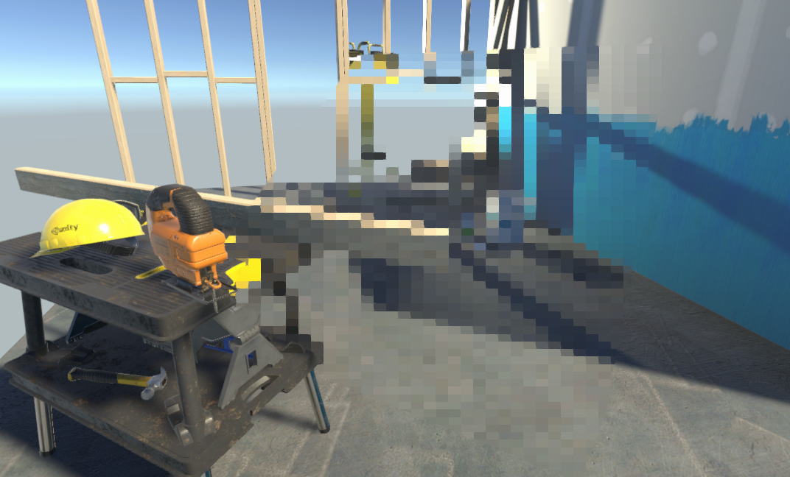
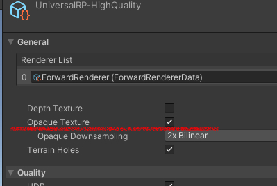
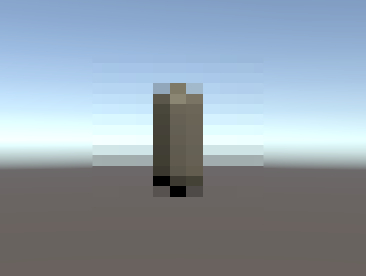
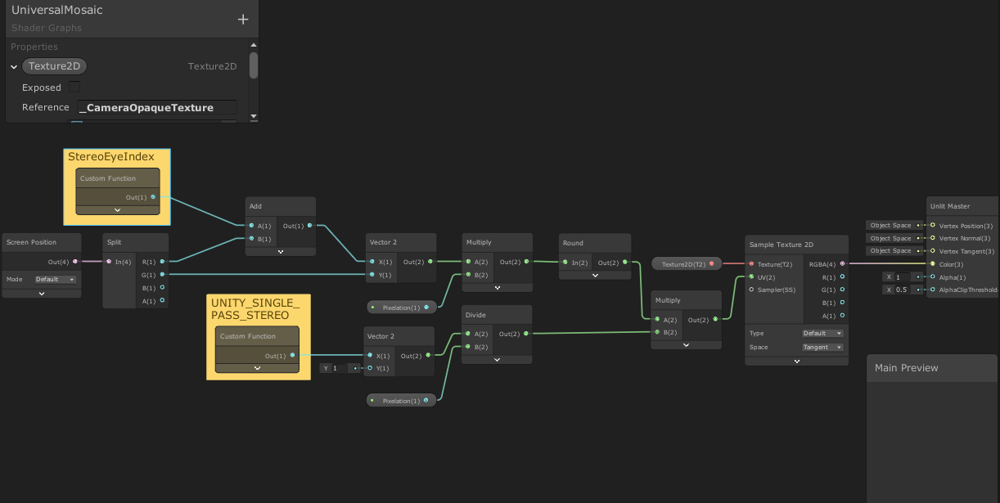
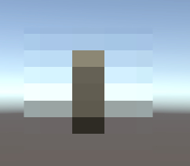
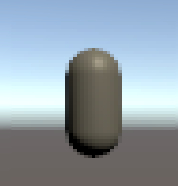

# UniversalRP Single Pass VR Mosaic Shader Graph

## Requirements
- Unity 2019.3.0f5  
    - Universal RP 7.1.7  

## Precondition
- Check Opaque Texture  

  

## Getting Started

Open UniversalMosaic/SampleScene  

  

Play VR Single Pass Stereo Rendering Mode.

A cube GameObject has the Mosaic Shader.  

  

## Usage  

Shader "Pixelation" Parameter can control mosaic resolution.  

Pixelation 30  

Pixelation 200  

